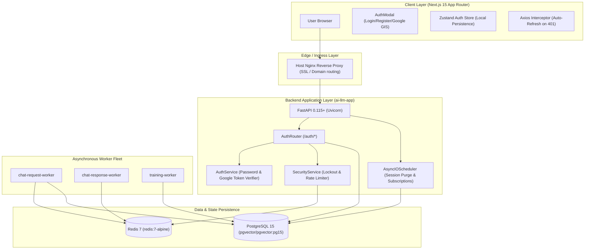
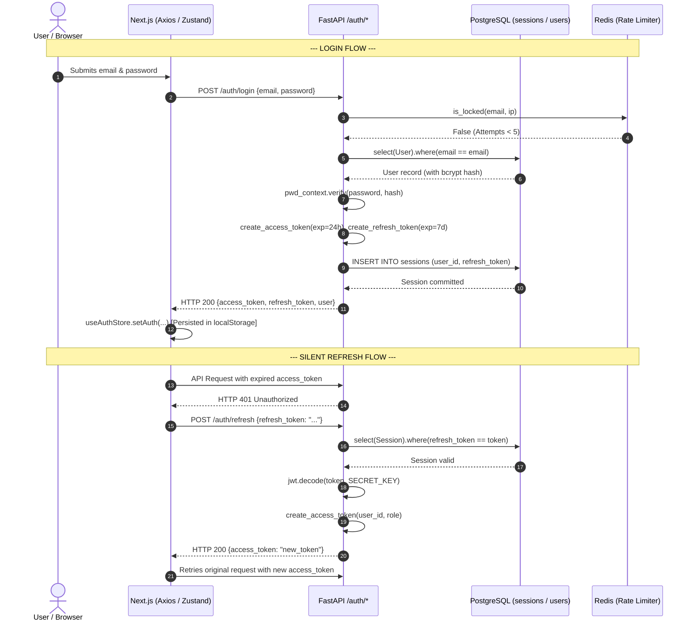

# 01 — Comprehensive Codebase & Architecture Map

## Executive Summary
This document provides an exhaustive, source-code-derived architecture map of the Patwatoli AI platform, covering backend services (`ai-llm`), frontend clients (`ai-platform-frontend`), database topology, cache architecture, security boundaries, and background workers.

---

## 1. System Architecture Topology

---

## 2. Discovered Services & Container Specifications

| Container Name | Image | Ports (Host->Container) | Healthcheck Command | Dependency Conditions |
| :--- | :--- | :--- | :--- | :--- |
| `ai-llm-app` | `python-backend-app` (Dockerfile) | `8000:8000` | N/A (FastAPI startup `SELECT 1`) | `postgres: service_healthy`, `redis: service_healthy` |
| `ai-llm-postgres` | `pgvector/pgvector:pg15` | `5433:5432` | `pg_isready -U $$POSTGRES_USER -d $$POSTGRES_DB && PGPASSWORD=$$POSTGRES_PASSWORD psql -U $$POSTGRES_USER -d $$POSTGRES_DB -c 'SELECT 1;'` | Volume: `postgres_data` |
| `ai-llm-redis` | `redis:7-alpine` | `6379:6379` | `redis-cli ping` | Volume: `redis_data` |
| `chat-request-worker` | `python-backend-chat-request-worker` | Internal | None | `postgres: service_healthy`, `redis: service_healthy` |
| `chat-response-worker`| `python-backend-chat-response-worker` | Internal | None | `redis: service_healthy` |
| `training-worker` | `python-backend-training-worker` | Internal | None | `postgres: service_healthy`, `redis: service_healthy` |

---

## 3. Discovered Endpoints & API Contracts

### Authentication Router (`/auth`)

| Method | Endpoint | Request Schema | Response Model | Auth Required | Purpose |
| :--- | :--- | :--- | :--- | :--- | :--- |
| `POST` | `/auth/signup` | `RegisterRequest` (`name`, `email`, `password`) | `UserResponse` (201) | No | User registration with bcrypt password hash |
| `POST` | `/auth/login` | `LoginRequest` (`email`, `password`) | `TokenResponse` (200) | No | Authenticate user, issue JWT access + refresh tokens, create DB session |
| `POST` | `/auth/google` | `GoogleAuthRequest` (`credential`) | `TokenResponse` (200) | No | Verify Google ID token, authenticate or auto-provision account |
| `POST` | `/auth/refresh` | `Optional[RefreshTokenRequest]` OR query param `refresh_token` | `RefreshTokenResponse` (200) | No | Issue new 24h access token using active 7d refresh token |
| `POST` | `/auth/logout` | `Optional[LogoutRequest]` OR query param `refresh_token` | `MessageResponse` (200) | No | Revoke single active session in DB without wiping global user quota |
| `POST` | `/auth/forgot-password`| `email: str` | `dict` (200) | No | Placeholder reset link endpoint |

---

## 4. Authentication & Token Lifecycle

---

## 5. Database Schema & Models (`PostgreSQL`)

### 1. `users` Table (`app/models/user.py`)
- `id` (Integer, Primary Key, Indexed)
- `name` (String, Nullable=False)
- `email` (String, Unique, Indexed)
- `password` (String, Bcrypt hash; `None` for pure Google OAuth users)
- `role` (String, Default="employee")
- `is_active` (Boolean, Default=True)
- `created_at` (DateTime, Default=datetime.utcnow)

### 2. `sessions` Table (`app/models/session.py`)
- `id` (Integer, Primary Key, Indexed)
- `user_id` (Integer, references user)
- `refresh_token` (String, Unique)
- `created_at` (DateTime, Default=datetime.utcnow)

---

## 6. Redis Key Topology

| Key Pattern | Data Type | TTL | Managed In | Business Purpose |
| :--- | :--- | :--- | :--- | :--- |
| `failed:{email}:{ip}` | Integer | 900s (15 min) | `app/services/security_service.py` | Tracks consecutive failed password attempts. Locks out after 5 failures. |
| `google_auth_ip:{ip}` | Integer | 900s (15 min) | `app/modules/auth/routes/auth_routes.py` | Rate-limits Google GIS token verification attempts per IP. |
| `usage:{user_id}` | Integer | 86400s (24h) | `app/modules/usage/services/usage_limit_service.py` | Tracks daily consumed AI tokens for plan quota enforcement. |
| `chat:memory:{session_id}` | JSON / List | Dynamic | `app/modules/memory/services/memory_service.py` | Active chat context window for RAG / LLM streaming. |
| `chat:stopped:{conv_id}` | String ("1") | 60s | `app/modules/chat/routes/chat_ws_routes.py` | Signals cancellation to streaming workers. |

---

## 7. Background Tasks & Schedulers

- **Scheduler Engine:** `apscheduler.schedulers.asyncio.AsyncIOScheduler`
- **Boot Lifecycle:** Initialized in `app/jobs/scheduler.py`, started in `app/main.py:startup_event()`, cleanly shutdown in `shutdown_event()`.
- **Registered Jobs:**
  1. `process_expired_subscriptions`: Daily at 00:05 UTC. Handles subscription cancellations and downgrades.
  2. `cleanup_expired_sessions`: Daily at 03:00 UTC. Purges session records older than `REFRESH_TOKEN_EXPIRE_DAYS + 1` (8 days).

---

## 8. Frontend Auth State Management

- **Store:** `src/stores/auth-store.ts` (Zustand with localStorage hydration).
- **Interceptor:** `src/services/api/client.ts`
  - Automatic `Bearer` header injection.
  - Intercepts 401 errors, queues in-flight requests, attempts `/auth/refresh` with `{ refresh_token }` in JSON body.
- **Sequential Logout:**
  - Captures `refreshToken`.
  - Awaits backend revocation via `POST /auth/logout`.
  - `finally` block guarantees local state & localStorage purge even under network failure.

