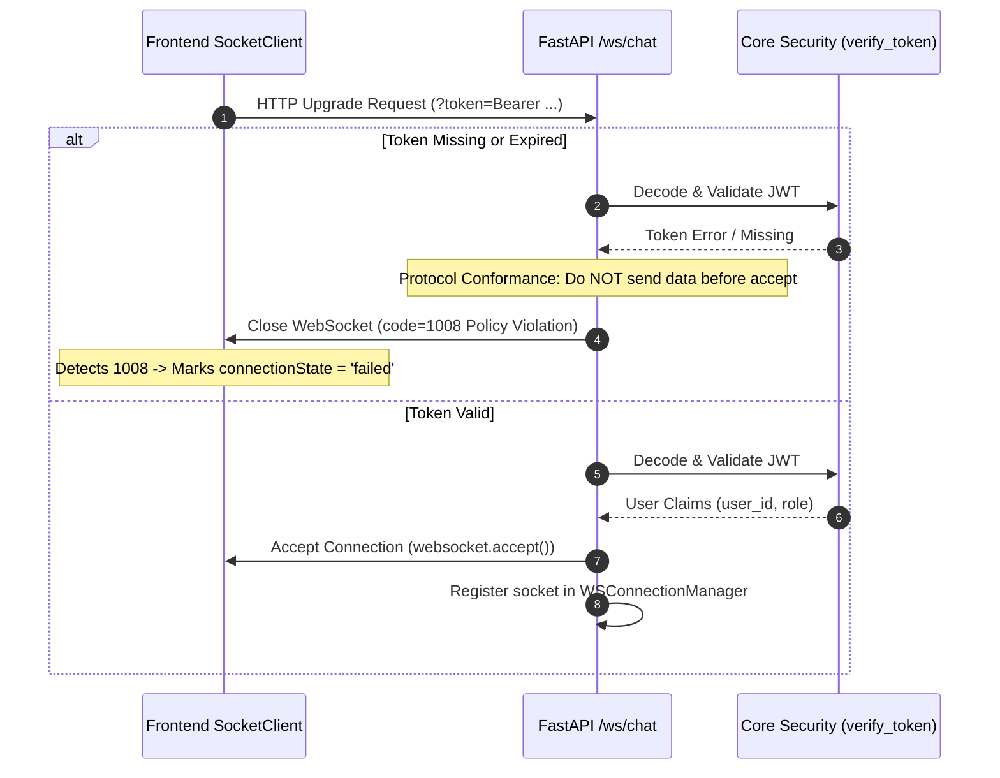

# WEBSOCKET CHAT LIFECYCLE & IDLE TIMEOUT SPECIFICATION

**Protocol:** Starlette / FastAPI WebSocket + Redis Pub/Sub Backchannel  
**Client:** `SocketClient` (`src/services/websocket/socket-client.ts`)  
**Server Endpoint:** `/ws/chat` (`app/modules/chat/routes/chat_ws_routes.py`)  
**Evaluation:** Staff SRE & Principal Architecture Review  

---

## 1. Architectural Analysis of the Disconnect Issue

In the initial implementation:
1. **Frontend Heartbeat:** `socketClient` sends `{"type": "ping"}` every `30,000ms` (30 seconds) via `setInterval`.
2. **Backend Receive Timeout:** `chat_ws_routes.py` executes:
   ```python
   data = await asyncio.wait_for(websocket.receive_json(), timeout=60)
```
3. **The Failure Mechanism:**
   - When a user navigates to another browser tab or minimizes the browser window, modern chromium engines (Chrome, Edge, Brave) apply **Background Tab Timer Throttling**.
   - Under throttling, `setInterval` callbacks are clamped to execute once every 60 seconds (or even once per 5 minutes under memory pressure).
   - Because the backend timeout was strictly `60 seconds`, any tiny timer delay (> 60.001s) caused `asyncio.wait_for` to raise `asyncio.TimeoutError`, which immediately executed `await websocket.close()` on line 511.
   - When the user returned to their chat window, they were greeted by a disconnected socket and interrupted streaming.

---

## 2. Definitive Lifecycle Design

### 2.1 Connection Handshake & Authentication Phase


### 2.2 Active Chat & Idle Keepalive Phase
- **Client Heartbeat Frequency:** Every 30 seconds, the client emits `{"type": "ping"}`.
- **Server Ping Handler:** Returns `{"type": "pong"}` without touching the database or Redis stream.
- **Server Inactivity Timeout:** Set to **180 seconds** (3 minutes).
  - Why 180s? 
    - It allows up to 5 missed or throttled client ping intervals (30s x 5 = 150s) before considering the socket dead.
    - It ensures that true orphaned sockets (e.g. mobile device abruptly killed or battery pulled) are cleanly garbage-collected within 3 minutes, preventing memory leaks in `WSConnectionManager`.
    - It completely eliminates false-positive tab throttling disconnects.

### 2.3 Per-Message Exception Isolation
In the original code:
```python
while True:
  # if an error occurred in message handling, it crashed the entire coroutine!
```
In the hardened code:
```python
while True:
  try:
    data = await asyncio.wait_for(websocket.receive_json(), timeout=180)
    # Process ping, stop, or chat message
  except WebSocketDisconnect:
    break  # Normal client disconnect
  except asyncio.TimeoutError:
    # 180s idle threshold reached -> close cleanly
    await websocket.close(code=1000)
    break
  except Exception as msg_err:
    # Isolate single message failure; keep connection alive
    logger.error(f"Error handling websocket message: {msg_err}")
    try:
      await websocket.send_json(
          {"type": "error", "message": "Failed to process message"}
      )
    except Exception:
      break
```

---

## 3. Summary of Parameters

| Parameter | Value | Justification |
|---|---|---|
| **Handshake Reject Code** | `1008` (Policy Violation) | Conforms to RFC 6455 §7.4.1 for authentication/authorization rejections. |
| **Client Ping Interval** | `30,000 ms` | Keeps NAT tables open across aggressive mobile 4G/5G firewalls. |
| **Server Receive Timeout** | `180 seconds` | Tolerates Chrome background tab throttling while bounding dead socket lifetime. |
| **Queue Backpressure** | `10 messages` | Prevents denial-of-service spam over a single WebSocket connection. |
